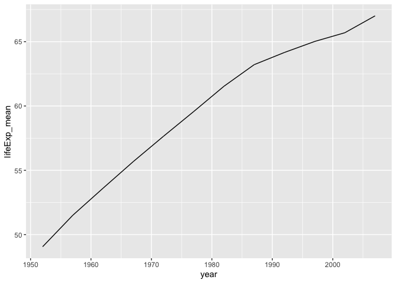
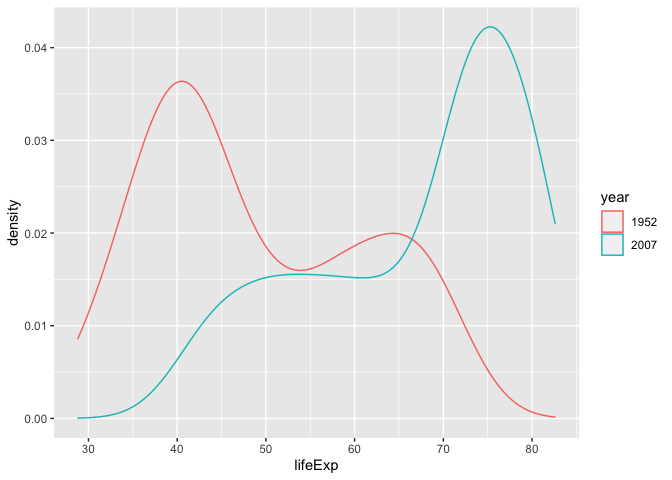
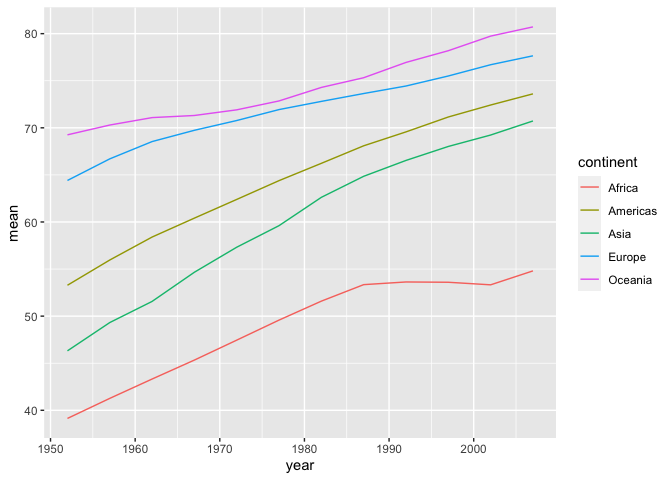
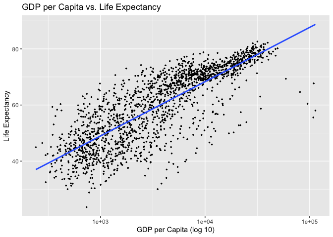
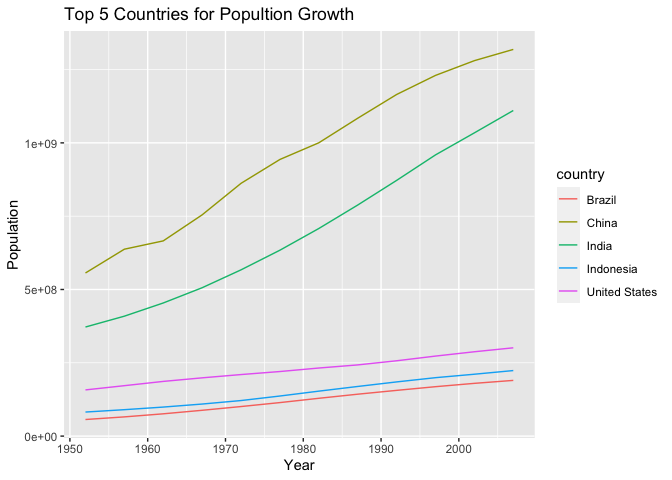
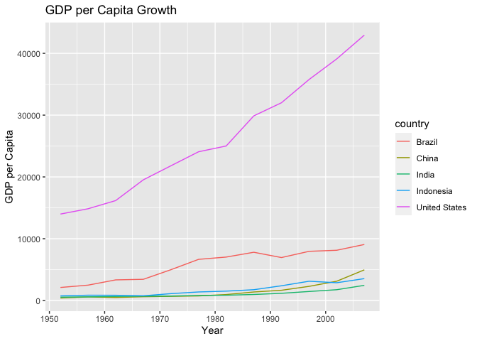
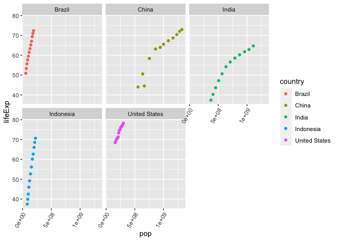

## Instructions
Answer the following questions and complete the exercises in RMarkdown. Please embed all of your code and push your final work to your repository. Your final lab report should be organized, clean, and run free from errors. Remember, you must remove the `#` for the included code chunks to run. Be sure to add your name to the author header above. For any included plots, make sure they are clearly labeled. You are free to use any plot type that you feel best communicates the results of your analysis.  

**In this homework, you should make use of the aesthetics you have learned. It's OK to be flashy!**

Make sure to use the formatting conventions of RMarkdown to make your report neat and clean!  

## Load the libraries

```r
library(tidyverse)
library(janitor)
library(here)
library(naniar)
library(dplyr)
```

## Resources
The idea for this assignment came from [Rebecca Barter's](http://www.rebeccabarter.com/blog/2017-11-17-ggplot2_tutorial/) ggplot tutorial so if you get stuck this is a good place to have a look.  

## Gapminder
For this assignment, we are going to use the dataset [gapminder](https://cran.r-project.org/web/packages/gapminder/index.html). Gapminder includes information about economics, population, and life expectancy from countries all over the world. You will need to install it before use. This is the same data that we will use for midterm 2 so this is good practice.

```r
#install.packages("gapminder")
library("gapminder")
```

## Questions
The questions below are open-ended and have many possible solutions. Your approach should, where appropriate, include numerical summaries and visuals. Be creative; assume you are building an analysis that you would ultimately present to an audience of stakeholders. Feel free to try out different `geoms` if they more clearly present your results.  

**1. Use the function(s) of your choice to get an idea of the overall structure of the data frame, including its dimensions, column names, variable classes, etc. As part of this, determine how NA's are treated in the data.**  


```r
view(gapminder)
```


```r
glimpse(gapminder)
```

```
## Rows: 1,704
## Columns: 6
## $ country   <fct> "Afghanistan", "Afghanistan", "Afghanistan", "Afghanistan", …
## $ continent <fct> Asia, Asia, Asia, Asia, Asia, Asia, Asia, Asia, Asia, Asia, …
## $ year      <int> 1952, 1957, 1962, 1967, 1972, 1977, 1982, 1987, 1992, 1997, …
## $ lifeExp   <dbl> 28.801, 30.332, 31.997, 34.020, 36.088, 38.438, 39.854, 40.8…
## $ pop       <int> 8425333, 9240934, 10267083, 11537966, 13079460, 14880372, 12…
## $ gdpPercap <dbl> 779.4453, 820.8530, 853.1007, 836.1971, 739.9811, 786.1134, …
```


```r
dim(gapminder)
```

```
## [1] 1704    6
```


```r
anyNA(gapminder)
```

```
## [1] FALSE
```


```r
naniar::miss_var_summary(gapminder)
```

```
## # A tibble: 6 × 3
##   variable  n_miss pct_miss
##   <chr>      <int>    <dbl>
## 1 country        0        0
## 2 continent      0        0
## 3 year           0        0
## 4 lifeExp        0        0
## 5 pop            0        0
## 6 gdpPercap      0        0
```

```r
names(gapminder)
```

```
## [1] "country"   "continent" "year"      "lifeExp"   "pop"       "gdpPercap"
```

**2. Among the interesting variables in gapminder is life expectancy. How has global life expectancy changed between 1952 and 2007?**


```r
gapminder %>% 
  group_by(year) %>% 
  summarise(max_life_exp = max(lifeExp),
            min_life_exp = min(lifeExp),
            mean_life_exp = mean(lifeExp))
```

```
## # A tibble: 12 × 4
##     year max_life_exp min_life_exp mean_life_exp
##    <int>        <dbl>        <dbl>         <dbl>
##  1  1952         72.7         28.8          49.1
##  2  1957         73.5         30.3          51.5
##  3  1962         73.7         32.0          53.6
##  4  1967         74.2         34.0          55.7
##  5  1972         74.7         35.4          57.6
##  6  1977         76.1         31.2          59.6
##  7  1982         77.1         38.4          61.5
##  8  1987         78.7         39.9          63.2
##  9  1992         79.4         23.6          64.2
## 10  1997         80.7         36.1          65.0
## 11  2002         82           39.2          65.7
## 12  2007         82.6         39.6          67.0
```


```r
gapminder %>%
  mutate(year = as.integer(year)) %>% 
  filter(year>="1952"| year<="2007") %>% 
  group_by(year) %>% 
  mutate(lifeExp_mean = mean(lifeExp)) %>% 
  ggplot(aes(x=year, y=lifeExp_mean))+
  geom_line()
```

<!-- -->

**3. How do the distributions of life expectancy compare for the years 1952 and 2007?**


```r
names(gapminder)
```

```
## [1] "country"   "continent" "year"      "lifeExp"   "pop"       "gdpPercap"
```


```r
gapminder %>%
  filter(year=="1952" | year=="2007") %>% 
   mutate(year=as.factor(year)) %>% 
  ggplot(aes(x=lifeExp, group=year, color=year))+
  geom_density()
```

<!-- -->

**4. Your answer above doesn't tell the whole story since life expectancy varies by region. Make a summary that shows the min, mean, and max life expectancy by continent for all years represented in the data.**


```r
gapminder %>% 
  group_by(continent) %>% 
  summarise(min_lifeExp = min(lifeExp),
            max_lifeExp = max(lifeExp),
            mean_lifeExp = mean(lifeExp))
```

```
## # A tibble: 5 × 4
##   continent min_lifeExp max_lifeExp mean_lifeExp
##   <fct>           <dbl>       <dbl>        <dbl>
## 1 Africa           23.6        76.4         48.9
## 2 Americas         37.6        80.7         64.7
## 3 Asia             28.8        82.6         60.1
## 4 Europe           43.6        81.8         71.9
## 5 Oceania          69.1        81.2         74.3
```

**5. How has life expectancy changed between 1952-2007 for each continent?**


```r
gapminder <- gapminder %>% 
  mutate(year = as.integer(year))
```


```r
gapminder %>% 
  group_by(year, continent) %>% 
  summarise(mean=mean(lifeExp)) %>% 
  ggplot(aes(x=year, y=mean, group=continent, color=continent))+
  geom_line()
```

```
## `summarise()` has grouped output by 'year'. You can override using the
## `.groups` argument.
```

<!-- -->

**6. We are interested in the relationship between per capita GDP and life expectancy; i.e. does having more money help you live longer?**


```r
gapminder %>% 
  ggplot(aes(x=gdpPercap, y=lifeExp))+
  geom_point(size=0.5)+
  scale_x_log10()+
  geom_smooth(method=lm, se=F)+
  labs(title = "GDP per Capita vs. Life Expectancy",
       x = "GDP per Capita (log 10)",
       y = "Life Expectancy")
```

```
## `geom_smooth()` using formula 'y ~ x'
```

<!-- -->
It seems like a higher GDP per capita does have a correlation to longer life expectancy. 

**7. Which countries have had the largest population growth since 1952?**


```r
gapminder <- gapminder %>% 
  mutate(year = as.integer(year))
```


```r
gapminder %>%
  select(country, year, pop) %>% 
  filter(year=="1952"| year=="2007") %>%
  pivot_wider(names_from = "year",
              names_prefix = "yr_",
              values_from = "pop")
```

```
## # A tibble: 142 × 3
##    country      yr_1952   yr_2007
##    <fct>          <int>     <int>
##  1 Afghanistan  8425333  31889923
##  2 Albania      1282697   3600523
##  3 Algeria      9279525  33333216
##  4 Angola       4232095  12420476
##  5 Argentina   17876956  40301927
##  6 Australia    8691212  20434176
##  7 Austria      6927772   8199783
##  8 Bahrain       120447    708573
##  9 Bangladesh  46886859 150448339
## 10 Belgium      8730405  10392226
## # … with 132 more rows
```
China, India, and the United States have had the largest population growth since 1952. 

**8. Use your results from the question above to plot population growth for the top five countries since 1952.**


```r
gapminder %>% 
  filter(country=="China" | country=="India" | country=="United States" | country=="Indonesia" | country=="Brazil") %>% 
  select(country, year, pop) %>% 
  ggplot(aes(x=year, y=pop, color = country))+
  geom_line()+
  labs(title = "Top 5 Countries for Popultion Growth",
       x= "Year",
       y= "Population")
```

<!-- -->

**9. How does per-capita GDP growth compare between these same five countries?**


```r
gapminder %>% 
  filter(country=="China" | country=="India" | country=="United States" | country=="Indonesia" | country=="Brazil") %>% 
  select(country, year, gdpPercap) %>% 
  ggplot(aes(x=year, y=gdpPercap, color=country))+
  geom_line()+
  labs(title = "GDP per Capita Growth",
       x= "Year",
       y= "GDP per Capita")
```

<!-- -->

**10. Make one plot of your choice that uses faceting!**


```r
names(gapminder)
```

```
## [1] "country"   "continent" "year"      "lifeExp"   "pop"       "gdpPercap"
```


```r
gapminder %>% 
  filter(country=="China" | country=="India" | country=="United States" | country=="Indonesia" | country=="Brazil") %>% 
  ggplot(aes(x=pop, y=lifeExp, color = country))+
  geom_point()+
  facet_wrap(~country)+
  theme(axis.text.x = element_text(angle = 60, hjust = 1))
```

<!-- -->

## Push your final code to GitHub!
Please be sure that you check the `keep md` file in the knit preferences. 
