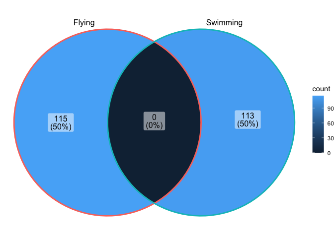
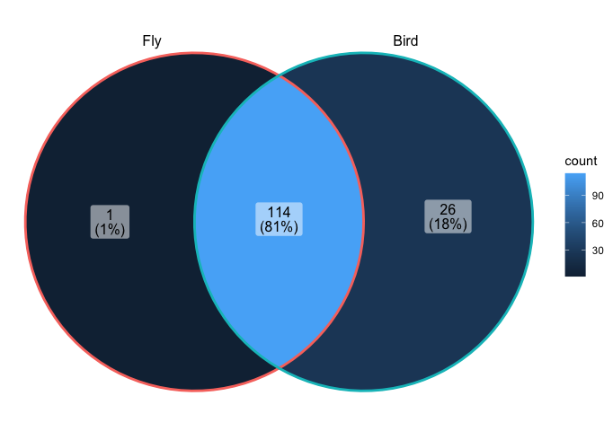
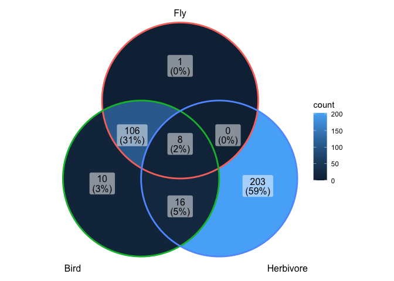
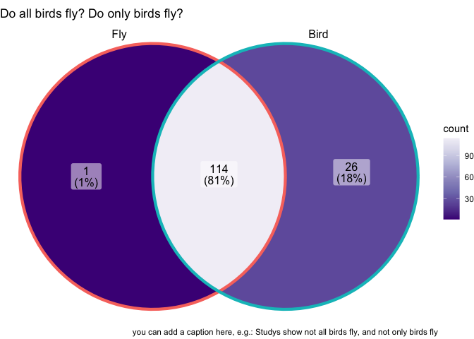
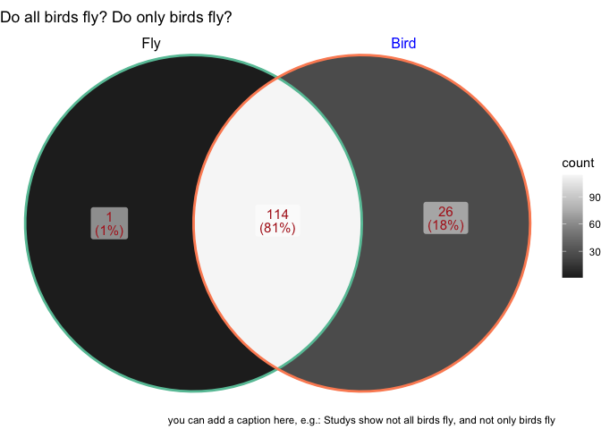
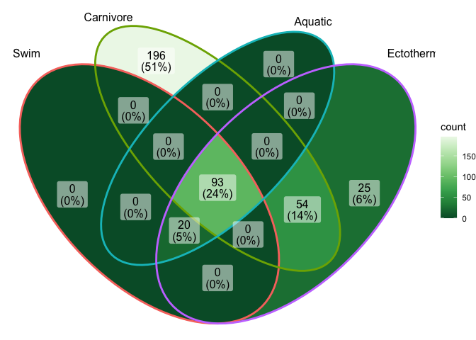
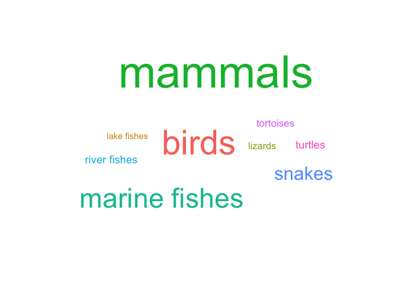
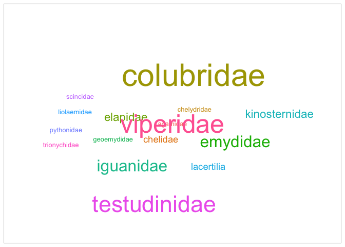

## Learning Goals
*At the end of this exercise, you will be able to:*    
1. Build a venn diagram
2. Build a word cloud


## Load Libraries

```r
library(tidyverse)
```

```
## ── Attaching packages ─────────────────────────────────────── tidyverse 1.3.1 ──
```

```
## ✓ ggplot2 3.3.5     ✓ purrr   0.3.4
## ✓ tibble  3.1.6     ✓ dplyr   1.0.8
## ✓ tidyr   1.2.0     ✓ stringr 1.4.0
## ✓ readr   2.1.2     ✓ forcats 0.5.1
```

```
## ── Conflicts ────────────────────────────────────────── tidyverse_conflicts() ──
## x dplyr::filter() masks stats::filter()
## x dplyr::lag()    masks stats::lag()
```

```r
#install.packages("ggVennDiagram")
library(ggVennDiagram)
library(RColorBrewer)
#install.packages("ggwordcloud")
library(ggwordcloud)
library(dplyr)
```

## Data
Let's use the homerange data-- I've slightly modified it with a new observation

```r
homerange <- read_csv("data/modified_Tamburelloetal_HomeRangeDatabase.csv")
```

```
## Rows: 570 Columns: 24
## ── Column specification ────────────────────────────────────────────────────────
## Delimiter: ","
## chr (16): taxon, common.name, class, order, family, genus, species, primarym...
## dbl  (8): mean.mass.g, log10.mass, mean.hra.m2, log10.hra, dimension, preyma...
## 
## ℹ Use `spec()` to retrieve the full column specification for this data.
## ℹ Specify the column types or set `show_col_types = FALSE` to quiet this message.
```

## Venn Diagrams

[great info here](https://cran.r-project.org/web/packages/ggVennDiagram/vignettes/using-ggVennDiagram.html) on how these are coded in ggplot. 

Sometimes its tricky to figure out what kind of data can be represented with a Venn diagram. I like to think of them as asking a series of questions about each row in you dataset, that are not mutually exclusive/inclusive. 

For the animals in the homerange database, we will ask a series of yes/no questions.

Let's start with: Do they fly? Do they swim? 
We will use `pull` to create a vector of the `common.name`s of animals that would answer this question with "yes".

Do they fly?

```r
flying_vec <- homerange %>%
  filter(locomotion == "flying")%>%
  pull(common.name)
```

Do they swim?

```r
swimming_vec <- homerange %>%
  filter(locomotion == "swimming")%>%
  pull(common.name)
```

To build a Venn diagram of these, we make a list of the vectors that represent our questions. 
The list represents the number of circles going into the venn diagram" and the vectors represent "what are the numbers going into the venn diagram"


```r
fly_or_swim_list <- list(flying_vec, swimming_vec)

ggVennDiagram(fly_or_swim_list, category.names = c("Flying", "Swimming"))
```

<!-- -->

Woah! an image!
But its not that useful. Since we are pretty familiar with this data, we know that `locomotion` is one column, and each animal only has one entry for locomotion, which is probably their primary for of movement. This results in `Swim` and `Fly` being mutually exclusive. 


So venn diagrams work best when asking questions **about data from 2 different columns**. 
Let's retry this with a more informative question: 

Do they fly? Are they a bird? 
We can recycle the `flying_vec`
Do they fly?

```r
flying_vec
```

```
##   [1] "golden eagle"                   "common buzzard"                
##   [3] "short-toed snake eagle"         "Bonelli's eagle"               
##   [5] "booted eagle"                   "Egyptian vulture"              
##   [7] "European nightjar"              "inca dove"                     
##   [9] "common wood pigeon"             "European turtle dove"          
##  [11] "European roller"                "hoopoe"                        
##  [13] "great spotted cuckoo"           "common cuckoo"                 
##  [15] "Cooper's hawk"                  "Northern goshawk"              
##  [17] "Eurasian sparrowhawk"           "sharp-shinned hawk"            
##  [19] "red-tailed hawk"                "red-shouldered hawk"           
##  [21] "Swainson's hawk"                "hen harrier"                   
##  [23] "Montagu's harrier"              "red kite"                      
##  [25] "lanner falcon"                  "prairie falcon"                
##  [27] "peregrine falcon"               "American kestrel"              
##  [29] "European kestrel"               "melodious warbler"             
##  [31] "long-tailed tit"                "woodlark"                      
##  [33] "red-throated ant tanager"       "red-crowned ant tanager"       
##  [35] "Eurasian treecreeper"           "streaked fantail warbler"      
##  [37] "common raven"                   "spotted nutcracker"            
##  [39] "Peruvian plantcutter"           "grasshopper sparrow"           
##  [41] "indigo bunting"                 "Abert's towhee"                
##  [43] "canyon towhee"                  "American tree sparrow"         
##  [45] "chipping sparrow"               "common linnet"                 
##  [47] "common chaffinch"               "European serin"                
##  [49] "eastern meadowlark"             "western meadowlard"            
##  [51] "yellow-breasted chat"           "red-backed shrike"             
##  [53] "loggerhead shrike"              "lesser grey shrike"            
##  [55] "woodchat shrike"                "northern mockingbird"          
##  [57] "white wagtail"                  "western yellow wagtail"        
##  [59] "spotted flycatcher"             "northern wheatear"             
##  [61] "common redstart"                "whinchat"                      
##  [63] "black-capped chickadee"         "Carolina chickadee"            
##  [65] "Oak titmouse"                   "marsh tit"                     
##  [67] "mourning warbler"               "common yellowthroat"           
##  [69] "prothonotary warbler"           "ovenbird"                      
##  [71] "Blackburnian warbler"           "Kirtland's warbler"            
##  [73] "magnolia warbler"               "chestnut-sided warbler"        
##  [75] "American yellow warbler"        "American redstart"             
##  [77] "black-throated green warbler"   "Canada warbler"                
##  [79] "Western Bonelli's warbler"      "common firecrest"              
##  [81] "goldcrest"                      "European nuthatch"             
##  [83] "wrentit"                        "Marmora's warbler"             
##  [85] "Dartford warbler"               "Berwick's wren"                
##  [87] "Carolina wren"                  "house wren"                    
##  [89] "Eurasian wren"                  "eastern bluebird"              
##  [91] "eastern wood pewee"             "least flycatcher"              
##  [93] "American gray flycatcher"       "eastern kingbird"              
##  [95] "black-capped vireo"             "Bell's vireo"                  
##  [97] "white-eyed vireo"               "red-eyed vireo"                
##  [99] "black woodpecker"               "Eurasian wryneck"              
## [101] "white-backed woodpecker"        "middle spotted woodpeckers"    
## [103] "Eurasian three-toed woodpecker" "grey-headed woodpecker"        
## [105] "European green woodpecker"      "boreal owl"                    
## [107] "long-eared owl"                 "little owl"                    
## [109] "Eurasian eagle-owl"             "great horned owl"              
## [111] "Eurasian pygmy owl"             "snowy owl"                     
## [113] "tawny owl"                      "barn owl"                      
## [115] "Whiskered Bat"
```

Are they a bird?

```r
bird_vec <- homerange %>%
  filter(taxon == "birds")%>%
  pull(common.name)
```


```r
fly_or_bird_list <- list(flying_vec, bird_vec)

ggVennDiagram(fly_or_bird_list, category.names = c("Fly", "Bird"))
```

<!-- -->


What are the 26 non-flying birds?

```r
homerange%>%
  filter(taxon == "birds")%>%
  filter(locomotion != "flying")%>%
  select(common.name)
```

```
## # A tibble: 26 × 1
##    common.name          
##    <chr>                
##  1 gadwall              
##  2 northern brown kiwi  
##  3 oystercatcher        
##  4 greater roadrunner   
##  5 banded ground-cuckoo 
##  6 caracara             
##  7 red-throated caracara
##  8 hazel grouse         
##  9 sage grouse          
## 10 dusky grouse         
## # … with 16 more rows
```

what is the flying non-bird?

```r
homerange %>% 
  filter(taxon!="birds") %>% 
  filter(locomotion=="flying") %>% 
  select(common.name)
```

```
## # A tibble: 1 × 1
##   common.name  
##   <chr>        
## 1 Whiskered Bat
```


### Adding Circles
Are they an herbivore?


```r
herbivore_vec <- homerange %>%
  filter(trophic.guild == "herbivore")%>%
  pull(common.name) #making vector from name
```


```r
fly_bird_herbi_list <- list(flying_vec, bird_vec, herbivore_vec)

ggVennDiagram(fly_bird_herbi_list, category.names = c("Fly", "Bird", "Herbivore"))
```

<!-- -->

### Make It Pretty!

Lets work with the 2 question plot for now:

```r
  # you can toggle edge size
venn_plot <- ggVennDiagram(fly_or_bird_list, category.names = c("Fly", "Bird"), edge_size = 1.5)

venn_plot +
  scale_fill_distiller(palette = "Purples")+ #distiller is for discrete data
  labs(title = "Do all birds fly? Do only birds fly?",
         caption = ("you can add a caption here, e.g.: Studys show not all birds fly, and not only birds fly")
  )
```

<!-- -->


```r
  # you can toggle edge size and label (Fly, Bird) colors here
ggVennDiagram(fly_or_bird_list,
              set_color = c("black", "blue"),             # sets label colors
              category.names = c("Fly", "Bird"),          # sets category label names
              label_color = "firebrick",                  # sets overlap-quantity label color
              label_size = 4                              # sets overlap-label size
              )+
  scale_color_brewer(palette = "Set2")+                   # sets palette for circle colors
  scale_fill_distiller(palette = "Greys")+                # distiller is for discrete data
  labs(title = "Do all birds fly? Do only birds fly?",
         caption = ("you can add a caption here, e.g.: Studys show not all birds fly, and not only birds fly") )
```

<!-- -->


## Practice

Try making a 4 circle Venn diagram to show the intersection of:
- swimming
- carnivores
- aquatic
- ectotherms

You can use locomotion, trophic guild, realm, and thermoregulation. 


```r
#Set Up the vectors:

   #you can also recycle the one we made earlier
swimming_vec<- homerange %>%
  filter(locomotion=="swimming")%>%
  pull(common.name)

carni_vec<- homerange %>%
  filter(trophic.guild=="carnivore")%>%
  pull(common.name)

aqua_vec <- homerange %>% 
  filter(realm == "aquatic")%>%
  pull(common.name)

ecto_vec<- homerange %>%
  filter(thermoregulation =="ectotherm")%>%
  pull(common.name)
```


```r
# Make the list of vectors:

swim_carni_aqua_ecto_list <- list(swimming_vec, carni_vec, aqua_vec, ecto_vec)
# Make the plot:

ggVennDiagram(swim_carni_aqua_ecto_list, category.names = c("Swim", "Carnivore", "Aquatic", "Ectotherm"))+
  scale_fill_distiller(palette = "greens")
```

```
## Warning in pal_name(palette, type): Unknown palette greens
```

<!-- -->


Use dplyr to determine which 20 animals from this plot are:
- Ectotherms
- Aquatic
- Swimmers
- NOT Carnivores?


```r
homerange %>% 
  filter(thermoregulation=="ectotherm" & locomotion=="swimming" & realm=="aquatic" & trophic.guild=="carnivore")
```

```
## # A tibble: 93 × 24
##    taxon        common.name class order family genus species primarymethod N    
##    <chr>        <chr>       <chr> <chr> <chr>  <chr> <chr>   <chr>         <chr>
##  1 lake fishes  american e… acti… angu… angui… angu… rostra… telemetry     16   
##  2 river fishes blacktail … acti… cypr… catos… moxo… poecil… mark-recaptu… <NA> 
##  3 river fishes central st… acti… cypr… cypri… camp… anomal… mark-recaptu… 20   
##  4 river fishes rosyside d… acti… cypr… cypri… clin… fundul… mark-recaptu… 26   
##  5 river fishes longnose d… acti… cypr… cypri… rhin… catara… mark-recaptu… 17   
##  6 river fishes muskellunge acti… esoc… esoci… esox  masqui… telemetry     5    
##  7 marine fish… pollack     acti… gadi… gadid… poll… pollac… telemetry     2    
##  8 marine fish… saithe      acti… gadi… gadid… poll… virens  telemetry     2    
##  9 marine fish… giant trev… acti… perc… caran… cara… ignobi… telemetry     4    
## 10 lake fishes  rock bass   acti… perc… centr… ambl… rupest… mark-recaptu… 16   
## # … with 83 more rows, and 15 more variables: mean.mass.g <dbl>,
## #   log10.mass <dbl>, alternative.mass.reference <chr>, mean.hra.m2 <dbl>,
## #   log10.hra <dbl>, hra.reference <chr>, realm <chr>, thermoregulation <chr>,
## #   locomotion <chr>, trophic.guild <chr>, dimension <dbl>, preymass <dbl>,
## #   log10.preymass <dbl>, PPMR <dbl>, prey.size.reference <chr>
```


## Word Clouds

Check out [this reference](https://lepennec.github.io/ggwordcloud/) on how word clouds are built in R. 


Word clouds allow you to make a image of multiple words, where their size is scaled to the frequency that they occur in the dataset. 

First, you have to make a frequency list with count, 

```r
hr_taxon_count <- homerange %>% 
  count(taxon)
hr_taxon_count
```

```
## # A tibble: 9 × 2
##   taxon             n
##   <chr>         <int>
## 1 birds           140
## 2 lake fishes       9
## 3 lizards          11
## 4 mammals         239
## 5 marine fishes    90
## 6 river fishes     14
## 7 snakes           41
## 8 tortoises        12
## 9 turtles          14
```

then you can plot like this!!

```r
hr_taxon_count %>% 
ggplot(aes(
  label = taxon, 
  size = n,
  color = taxon
  )) +
  geom_text_wordcloud() +
  scale_size_area(max_size = 20) +
  theme_minimal()
```

<!-- -->

## Practice
in the homework, we will make word clouds with the super hero data. 

For now, practice word clouds by making a could of all the different families in the class `reptilia`.
If they dont fit, try tinkering the `scale_size_area(max_size =   )`

make the count table:

```r
reptilia_count <- homerange %>% 
  filter(class=="reptilia") %>% 
  count(family)
reptilia_count
```

```
## # A tibble: 16 × 2
##    family            n
##    <chr>         <int>
##  1 agamidae          1
##  2 chelidae          2
##  3 chelydridae       1
##  4 colubridae       22
##  5 elapidae          3
##  6 emydidae          6
##  7 geoemydidae       1
##  8 iguanidae         6
##  9 kinosternidae     3
## 10 lacertilia        2
## 11 liolaemidae       1
## 12 pythonidae        1
## 13 scincidae         1
## 14 testudinidae     12
## 15 trionychidae      1
## 16 viperidae        15
```


make the plot:

```r
reptilia_count %>% 
  ggplot(aes(
    label = family,
    size = n, 
    color = family
  ))+
  geom_text_wordcloud()+
  scale_size_area(max_size = 16)+
  theme_light()
```

```
## Warning in wordcloud_boxes(data_points = points_valid_first, boxes = boxes, :
## One word could not fit on page. It has been placed at its original position.
```

<!-- -->
